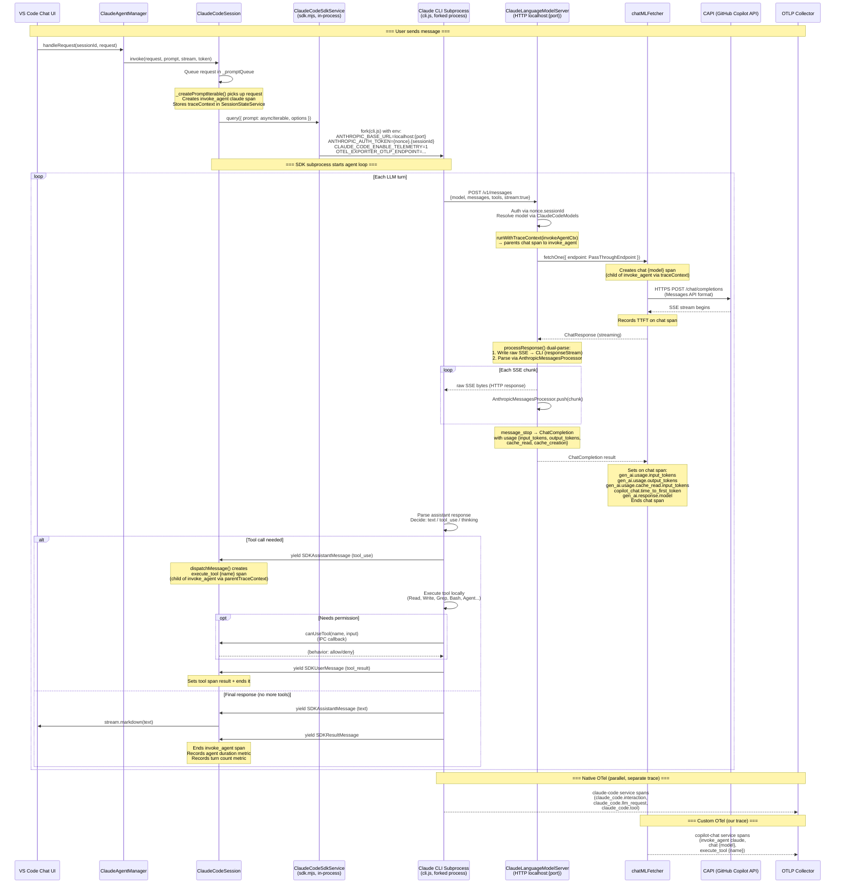
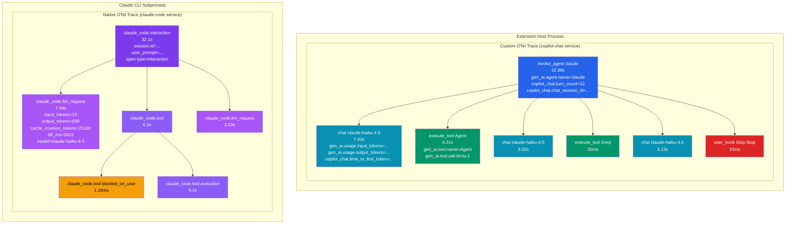

# Claude Agent Request Flow

```mermaid
sequenceDiagram
    participant UI as VS Code Chat UI
    participant CM as ClaudeAgentManager
    participant CS as ClaudeCodeSession
    participant SDK as ClaudeCodeSdkService<br/>(sdk.mjs, in-process)
    participant CLI as Claude CLI Subprocess<br/>(cli.js, forked process)
    participant LMS as ClaudeLanguageModelServer<br/>(HTTP localhost:{port})
    participant FET as chatMLFetcher
    participant CAPI as CAPI (GitHub Copilot API)
    participant OTEL as OTLP Collector

    Note over UI,OTEL: === User sends message ===

    UI->>CM: handleRequest(sessionId, request)
    CM->>CS: invoke(request, prompt, stream, token)
    CS->>CS: Queue request in _promptQueue

    Note over CS: _createPromptIterable() picks up request<br/>Creates invoke_agent claude span<br/>Stores traceContext in SessionStateService

    CS->>SDK: query({ prompt: asyncIterable, options })
    SDK->>CLI: fork(cli.js) with env:<br/>ANTHROPIC_BASE_URL=localhost:{port}<br/>ANTHROPIC_AUTH_TOKEN={nonce}.{sessionId}<br/>CLAUDE_CODE_ENABLE_TELEMETRY=1<br/>OTEL_EXPORTER_OTLP_ENDPOINT=...

    Note over CS,CLI: === SDK subprocess starts agent loop ===

    loop Each LLM turn
        CLI->>LMS: POST /v1/messages<br/>{model, messages, tools, stream:true}

        LMS->>LMS: Auth via nonce.sessionId<br/>Resolve model via ClaudeCodeModels

        Note over LMS: runWithTraceContext(invokeAgentCtx)<br/>→ parents chat span to invoke_agent

        LMS->>FET: fetchOne({ endpoint: PassThroughEndpoint })

        Note over FET: Creates chat {model} span<br/>(child of invoke_agent via traceContext)

        FET->>CAPI: HTTPS POST /chat/completions<br/>(Messages API format)
        CAPI-->>FET: SSE stream begins

        Note over FET: Records TTFT on chat span

        FET-->>LMS: ChatResponse (streaming)

        Note over LMS: processResponse() dual-parse:<br/>1. Write raw SSE → CLI (responseStream)<br/>2. Parse via AnthropicMessagesProcessor

        loop Each SSE chunk
            LMS-->>CLI: raw SSE bytes (HTTP response)
            LMS->>LMS: AnthropicMessagesProcessor.push(chunk)
        end

        Note over LMS: message_stop → ChatCompletion<br/>with usage {input_tokens, output_tokens,<br/>cache_read, cache_creation}

        LMS-->>FET: ChatCompletion result

        Note over FET: Sets on chat span:<br/>gen_ai.usage.input_tokens<br/>gen_ai.usage.output_tokens<br/>gen_ai.usage.cache_read.input_tokens<br/>copilot_chat.time_to_first_token<br/>gen_ai.response.model<br/>Ends chat span

        CLI->>CLI: Parse assistant response<br/>Decide: text / tool_use / thinking

        alt Tool call needed
            CLI->>CS: yield SDKAssistantMessage (tool_use)

            Note over CS: dispatchMessage() creates<br/>execute_tool {name} span<br/>(child of invoke_agent via parentTraceContext)

            CLI->>CLI: Execute tool locally<br/>(Read, Write, Grep, Bash, Agent...)

            opt Needs permission
                CLI->>CS: canUseTool(name, input)<br/>(IPC callback)
                CS-->>CLI: {behavior: allow/deny}
            end

            CLI->>CS: yield SDKUserMessage (tool_result)

            Note over CS: Sets tool span result + ends it

        else Final response (no more tools)
            CLI->>CS: yield SDKAssistantMessage (text)
            CS->>UI: stream.markdown(text)
            CLI->>CS: yield SDKResultMessage
            Note over CS: Ends invoke_agent span<br/>Records agent duration metric<br/>Records turn count metric
        end
    end

    Note over CLI,OTEL: === Native OTel (parallel, separate trace) ===
    CLI-->>OTEL: claude-code service spans<br/>(claude_code.interaction,<br/>claude_code.llm_request,<br/>claude_code.tool)

    Note over FET,OTEL: === Custom OTel (our trace) ===
    FET-->>OTEL: copilot-chat service spans<br/>(invoke_agent claude,<br/>chat {model},<br/>execute_tool {name})
```

```mermaid
graph TB
    subgraph "Extension Host Process"
        subgraph "Custom OTel Trace (copilot-chat service)"
            IA["invoke_agent claude<br/>32.89s<br/>gen_ai.agent.name=claude<br/>copilot_chat.turn_count=12<br/>copilot_chat.chat_session_id=..."]
            C1["chat claude-haiku-4.5<br/>7.42s<br/>gen_ai.usage.input_tokens=...<br/>gen_ai.usage.output_tokens=...<br/>copilot_chat.time_to_first_token=..."]
            ET1["execute_tool Agent<br/>6.21s<br/>gen_ai.tool.name=Agent<br/>gen_ai.tool.call.id=tu-1"]
            C2["chat claude-haiku-4.5<br/>3.02s"]
            ET2["execute_tool Grep<br/>20ms"]
            C3["chat claude-haiku-4.5<br/>3.13s"]
            UH["user_hook Stop:Stop<br/>10ms"]

            IA --> C1
            IA --> ET1
            IA --> C2
            IA --> ET2
            IA --> C3
            IA --> UH
        end
    end

    subgraph "Claude CLI Subprocess"
        subgraph "Native OTel Trace (claude-code service)"
            INT["claude_code.interaction<br/>32.1s<br/>session.id=...<br/>user_prompt=...<br/>span.type=interaction"]
            LLM1["claude_code.llm_request<br/>7.44s<br/>input_tokens=10<br/>output_tokens=699<br/>cache_creation_tokens=25190<br/>ttft_ms=2623<br/>model=claude-haiku-4-5"]
            T1["claude_code.tool<br/>6.2s"]
            TB1["claude_code.tool.blocked_on_user<br/>1.16ms"]
            TE1["claude_code.tool.execution<br/>6.2s"]
            LLM2["claude_code.llm_request<br/>3.03s"]

            INT --> LLM1
            INT --> T1
            T1 --> TB1
            T1 --> TE1
            INT --> LLM2
        end
    end

    style IA fill:#2563eb,color:#fff
    style INT fill:#7c3aed,color:#fff
    style C1 fill:#0891b2,color:#fff
    style C2 fill:#0891b2,color:#fff
    style C3 fill:#0891b2,color:#fff
    style LLM1 fill:#a855f7,color:#fff
    style LLM2 fill:#a855f7,color:#fff
    style ET1 fill:#059669,color:#fff
    style ET2 fill:#059669,color:#fff
    style T1 fill:#8b5cf6,color:#fff
    style TB1 fill:#f59e0b,color:#000
    style TE1 fill:#8b5cf6,color:#fff
    style UH fill:#dc2626,color:#fff
```