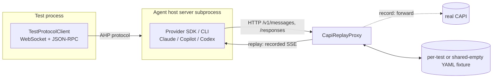

# Agent host end-to-end tests

End-to-end tests that exercise the **whole agent host** — the real server process, the real bundled provider SDK/CLI subprocess (Claude / Copilot / Codex), and the real JSON-RPC + AHP protocol over a WebSocket — **without a token and without network**.

They do this by recording the model traffic once (against real CAPI) into committed YAML fixtures, then **replaying** those fixtures deterministically on every run. Only the *model responses* are faked; everything else (the server, the SDK subprocess, tool execution, the protocol) is real.

> **New here?** Read [Mental model](#mental-model), then [Running the tests](#running-the-tests). Writing a test? Jump to [Writing a new test](#writing-a-new-test). CI is red? Jump to [Troubleshooting](#troubleshooting).

> These are **e2e tests**. The `*.integrationTest.ts` file suffix and `test-integration.sh` script are just the VS Code test-runner conventions they hook into.

---

## TL;DR

```bash
# Replay (default): deterministic, tokenless. This is what CI runs.
./scripts/test-integration.sh --run src/vs/platform/agentHost/test/node/e2e/providers/copilotAgentHostE2E.integrationTest.ts

# Update AHP snapshots only, replaying the existing LLM fixtures (tokenless).
AGENT_HOST_UPDATE_AHP_SNAPSHOTS=1 ./scripts/test-integration.sh --run src/vs/platform/agentHost/test/node/e2e/providers/copilotAgentHostE2E.integrationTest.ts

# Update both AHP snapshots and LLM fixtures (real CAPI; needs a GitHub token).
AGENT_HOST_UPDATE_SNAPSHOTS=1 ./scripts/test-integration.sh --run src/vs/platform/agentHost/test/node/e2e/providers/copilotAgentHostE2E.integrationTest.ts
```

- **Replay** (no env var) — serves committed fixtures, no upstream contact, no credential. Strict: an unrecorded request fails the run.
- **Update AHP** (`AGENT_HOST_UPDATE_AHP_SNAPSHOTS=1`) — replays committed LLM fixtures and rewrites AHP `serverToClient` snapshots in place. No token or network.
- **Update all** (`AGENT_HOST_UPDATE_SNAPSHOTS=1`) — rewrites AHP snapshots and forwards to real CAPI to re-record LLM fixtures. Needs `GITHUB_TOKEN` or `gh auth token`.
- **Record LLM only** (`AGENT_HOST_REPLAY_RECORD=1`) — the legacy focused mode for re-recording only normalized LLM fixtures against real CAPI.

---

## Mental model

A small HTTP proxy — `CapiReplayProxy` — sits between the agent host and CAPI. The agent host is pointed at the proxy via env overrides (`COPILOT_API_URL`, `VSCODE_AGENT_HOST_CAPI_URL_OVERRIDE`, …). The proxy is the only thing that changes between record and replay:



Key properties:

- **Sequence-based matching**, keyed by `(method, path)`: the *Nth* request to an endpoint replays the *Nth* recorded response. There is **no request-body matching** — the recorded responses drive the agent, so it reproduces the same call sequence. (Bodies are stored only for human review.)
- **Wire-agnostic**: works for Anthropic Messages (`/v1/messages`) and OpenAI Responses (`/responses`) SSE dialects.
- **Strict on replay**: a request with no recorded response is a hard cache miss that fails the test — CI can never silently reach real CAPI.
- **Ancillary bootstrap endpoints are stubbed, not recorded** (see [What's stubbed](#whats-stubbed-vs-recorded)) — keeps identity, tokens, and the model catalog out of fixtures.
- **Isolated persistent state**: each shared test uses a temporary home and VS Code user-data directory, which teardown removes after the agent host exits.

---

## Organization

| Path | Role |
|---|---|
| `providers/` | Deterministic provider entry points and provider-specific scenarios. Live Codex scenarios are isolated in `codexAgentHostLive.integrationTest.ts`. |
| `suites/` | Cross-provider scenarios grouped by behavior. Add new shared scenarios to the closest existing suite; add a suite module when a new behavior area emerges. |
| `harness/` | Record/replay, AHP snapshots, shared turn drivers, and server lifecycle. |
| `captures/*.yaml` | Committed model fixtures, plus one shared strict empty fixture for tests that declare no model traffic. |
| `providers/__snapshots__/` | Semantic AHP snapshots for deterministic provider tests. |

Use these deterministic E2E tests when the value comes from running the bundled provider process with realistic captured model behavior: SDK event ordering, tool schemas and execution, provider persistence, protocol-to-provider mapping, or cross-provider parity. Use `../providerIntegration/` for a real provider with a synthetic local LLM, `../protocol/` when `ScriptedMockAgent` can express the AHP contract precisely, and an ordinary unit test when no server process is required.

---

## Fixture format

Model-backed fixtures live in `captures/` and are named `${provider}-${slugified-test-title}.yaml`. Tests registered with `hostOnlyTest(...)` instead use `captures/empty.yaml` in strict replay mode. Any unexpected model request is therefore a hard cache miss, including during fixture-recording runs, without creating one empty file per host-only test.

Fixtures are intentionally minimal and human-reviewable:

```yaml
version: 1
dialect: anthropic          # anthropic → POST /v1/messages, responses → POST /responses
exchanges:
  - request:                # normalized request summary (for review only; not matched)
      model: claude-opus-4.8
      system: ${system}
      messages:
        - role: user
          content: Say exactly "hello" and nothing else
    response:               # the captured assistant reply, replayed as SSE
      content: hello
      stopReason: end_turn
```

- **`dialect`** is stored **once** at the top. It determines both the endpoint the turns bucket under (`method`/`path` are derived, always `POST`) and which SSE regenerator to use. It's the one wire fact that can't be recovered from the normalized turn, so it can't be dropped. Fixtures with no model turns (e.g. `listModels`) omit it.
- **Each exchange** is just `request` + `response`. Tool-calling replies store `content` as a block list (`text` / `tool_use`); simple replies store a bare string.
- **New recordings omit token usage.** Exact counts are volatile recording metadata, not model behavior. Older captures may still contain ignored `usage` fields; replay emits stable positive placeholder counts so usage-dependent Agent Host paths remain exercised without fixture churn.
- **Placeholders** are substituted at record time so fixtures are deterministic and secret-free:

  | Placeholder | Replaces |
  |---|---|
  | `${workdir}` | the test's temp working directory |
  | `${temp}` | the random six-character suffix generated by `mkdtemp` |
  | `${homedir}` | the recorder's home directory |
  | `${user}` | the recorder's OS username (e.g. in `ls -la` owner columns) |
  | `${capi}` | the upstream CAPI origin (rewritten back to the proxy URL on replay) |
  | `${redacted}` | minted session tokens (`token` / `session_token` fields) |
  | `${system}` | the echoed system prompt (Responses API echoes `instructions`) |

  Tool-call ids are also normalized to stable ordinals (`toolcall_0`, `toolcall_1`, …).

---

## Running the tests

Replay is the default — no setup, no token:

```bash
./scripts/test-integration.sh --run src/vs/platform/agentHost/test/node/e2e/providers/copilotAgentHostE2E.integrationTest.ts
```

Provider availability:

- **Copilot** (`copilotcli`) — always enabled (the CLI is a dev dependency).
- **Claude** — enabled when `node_modules/@anthropic-ai/claude-agent-sdk` is present (dev dep).
- **Codex** — shared suite enabled when `node_modules/@openai/codex` is present. Codex-specific *steering* tests (real-time, non-deterministic) are extra and gated behind `AGENT_HOST_REAL_CODEX=1`.

---

## Server lifecycle

Each test needs an agent host server (a forked subprocess) fronted by a `CapiReplayProxy`. `AgentHostE2EServerLease` (in `harness/agentHostE2ETestHarness.ts`) owns that lifecycle and picks one of two strategies:

- **Per-test** (always while recording) — fork a fresh server + proxy for every test and kill it in teardown. Full isolation: nothing carries over between tests. The cost is that every test re-pays the server fork **and** the provider SDK/CLI cold start (`_ensureClient` spawns and caches the CLI subprocess per server).

- **Shared** (the default in replay, for every provider) — fork the server + proxy **once** for the whole suite, then between tests swap the per-test fixture and reconnect a fresh client. The agent host's cached SDK client / CLI subprocess is reused, so only the first test pays that startup. This roughly halves the suite wall-clock.

The swap is what makes sharing cheap: the proxy is an `http.Server` running **inside the test process**, so `CapiReplayProxy.resetForReplay(fixturePath)` is a plain in-process method call — no IPC, no re-fork. It reloads the replay buckets and clears the cache-miss log while keeping the **same proxy URL**, so the long-lived agent host (forked against that URL) keeps talking to the same proxy and just receives the next fixture's recorded responses. Teardown calls `assertNoCacheMisses()` to verify a test's traffic *without* stopping the server (vs `stop()`, which verifies then closes); the suite's `suiteTeardown` closes it via `close()`.

**The one invariant: a shared-server test must not leave a turn in flight.** Because one server serves every test, each test's request/response traffic must land inside its own fixture window. If a test returns mid-turn, the SDK's continuation HTTP call fires *after* the fixture has been swapped for the next test — landing in that test's window as an unrecorded call and failing the strict cache-miss check (attributed, confusingly, to the next test). So **drain every turn to `turnComplete` before the test ends**; that consumes the continuation against the fixture that owns it. This is why the permission test drains its post-tool continuation even in replay, and it's the whole reason server reuse is safe: with no mid-turn returns there is nothing to leak.

> Historical note: an older comment warned that "Claude's mid-turn dispose leaves the agent host in a bad state." That dates from the live real-SDK era (real streaming turns actually in flight). In the deterministic replay suite the only mid-turn paths are gone — the abort test is record-only, and turns drain — so all providers reuse the server safely. Recording still uses a fresh proxy + fixture per test regardless of the flag (a proxy records to one fixture at a time).

---

## Collecting coverage

Run the deterministic full-stack provider suites and collect native V8 coverage from the Agent Host processes:

```bash
npm run test-agent-host-e2e-coverage
```

The command retranspiles the sources, runs only the Claude, Codex, and Copilot E2E suites in replay mode, and sets `AGENT_HOST_E2E_COVERAGE=1`. These suites exercise the real Agent Host server, bundled provider process, AHP transport, and local tools; only model traffic is replayed. Mock-agent protocol tests, mocked-LLM provider tests, and direct SDK integration tests do not contribute to this coverage report.

The coverage opt-in sets `NODE_V8_COVERAGE` only on Agent Host child processes. Provider suite teardown closes the server's stdin and awaits its graceful shutdown so Node flushes coverage after the host finishes its existing persistence cleanup.

After the tests pass, `c8` combines the raw process data and source-maps it to TypeScript. The report includes only loaded executable files under `src/vs/platform/agentHost/common/` and `src/vs/platform/agentHost/node/`; unloaded files, tests, provider dependencies, and generated type-only modules are outside the denominator.

Outputs:

- `.build/agent-host-e2e-coverage/raw/` — raw V8 process coverage.
- `.build/agent-host-e2e-coverage/report/index.html` — browsable HTML report.
- `.build/agent-host-e2e-coverage/report/lcov.info` — LCOV output for editor tooling.
- `.build/agent-host-e2e-coverage/report/coverage-summary.json` — full c8 JSON summary.
- `coverage/summary.json` — checked-in combined totals and sorted per-file metrics.

Every successful coverage run rewrites the checked-in stats. Test, report, or normalization failures leave the previous stats untouched. The stats are informational for now: there is no threshold, regression check, or commit gate yet. Asynchronous host and provider startup can cover slightly different executable ranges across otherwise identical runs, so a future gate must define an intentional tolerance or ratchet policy rather than assuming byte-identical stats.

Per-provider reports are deferred until there is a concrete need. Per-test attribution is also intentionally out of scope for native aggregate coverage; it would require inspector-based precise coverage snapshots and deltas.

---

## Updating snapshots and fixtures

Normal test runs are read-only. An AHP mismatch fails and writes a sibling `.actual` file for diagnosis. Use an explicit update mode to accept changes in place:

```bash
# Update only AHP snapshots using deterministic, tokenless LLM replay:
AGENT_HOST_UPDATE_AHP_SNAPSHOTS=1 ./scripts/test-integration.sh --run \
  src/vs/platform/agentHost/test/node/e2e/providers/copilotAgentHostE2E.integrationTest.ts

# Update LLM fixtures and AHP snapshots together:
AGENT_HOST_UPDATE_SNAPSHOTS=1 ./scripts/test-integration.sh --run \
  src/vs/platform/agentHost/test/node/e2e/providers/copilotAgentHostE2E.integrationTest.ts

# Re-record only LLM fixtures (legacy focused mode):
AGENT_HOST_REPLAY_RECORD=1 ./scripts/test-integration.sh --run \
  src/vs/platform/agentHost/test/node/e2e/providers/copilotAgentHostE2E.integrationTest.ts
```

The AHP update preserves the executable `clientToServer` input and replaces only `serverToClient` with the observed semantic traffic. Review the resulting Git diff, then rerun without an update flag to verify the committed snapshot.

`AGENT_HOST_UPDATE_SNAPSHOTS=1` records both boundaries in one run. The AHP recorder coalesces streamed `chat/responsePart` + `chat/delta` traffic into final semantic content, so live CAPI chunking and replay-generated chunking produce the same snapshot. `AGENT_HOST_REPLAY_RECORD=1` updates only LLM fixtures.

The update scope is the tests selected by the command. Running a whole provider file intentionally re-records every test in that file, so provider-default model changes can produce broad fixture diffs. Add `--grep "<test title>"` when only one scenario needs updating. Record-only scenarios such as abort are excluded from combined updates.

1. The proxy forwards all traffic to real CAPI (`AGENT_HOST_RECORD_CAPI_URL`, default `https://api.githubcopilot.com`) and GitHub (`AGENT_HOST_RECORD_GITHUB_URL`, default `https://api.github.com`).
2. Auth: `GITHUB_TOKEN` (preferred) or `gh auth token`. The GitHub token is used directly as the CAPI bearer credential (same pattern as the `@github/copilot` CLI). It lives only in request headers and is **never** written to fixtures.
3. Model responses are captured, normalized (placeholders + redaction), and written to the per-test fixture. Ancillary endpoints are forwarded but **not** stored.

After recording, **review the diff** (paths normalized? no usernames, tokens, or unreleased model ids?) and commit the updated snapshots and fixtures.

> Recording creates real agent sessions. Keep prompts read-only / trivial (`echo`, `pwd`, list files) and scoped to isolated temp dirs.

---

## Writing a new test

Most tests are cross-provider and live in a focused module under `suites/`. A shared test receives `IAgentHostE2ETestContext` and registers its cases:

```ts
export function defineMyBehaviorTests(context: IAgentHostE2ETestContext): void {
  const { config, createdSessions, tempDirs } = context;

  test('my new behavior', async function () {
    this.timeout(120_000);
    const workspace = mkdtempSync(join(tmpdir(), 'e2e-mine-'));
    tempDirs.push(workspace);
    const sessionUri = await createRealSession(context.client, config, `e2e-mine-${config.provider}`, createdSessions, URI.file(workspace));
    dispatchTurn(context.client, sessionUri, 'turn-1', 'Do the thing', 1);
  });
}
```

Guidelines:

1. **The fixture name is derived from the test title** (`${provider}-${slug}.yaml`). Renaming a test orphans its fixture — re-record after renaming.
2. **Drive with `client.waitForNotification(...)`** and assert on protocol actions. Don't wait on wall-clock timing.
3. **Choose the model boundary explicitly**: register tests that must make no model requests with `hostOnlyTest(context, ...)`; otherwise add the test normally and run once with `AGENT_HOST_UPDATE_SNAPSHOTS=1` to capture AHP snapshots and LLM fixtures for every enabled provider.
4. **Keep prompts deterministic and minimal** — fewer model turns = smaller, more robust fixtures.
5. Register a new shared suite from `suites/agentHostE2ESuites.ts`. **Provider-specific** assertions stay in that provider's entry point.
6. If the behavior can't replay deterministically (real-time streaming, mid-turn aborts, concurrency), gate it — see below.

`hostOnlyTest(...)` applies the shared timeout and records the title with the suite harness before Mocha runs. The harness routes that title to the shared empty fixture. Do not use it merely to avoid recording a prompt: it is an executable assertion that the full provider stack reaches the tested behavior without crossing the model boundary.

### AHP traffic snapshots

An AHP snapshot is executable and contains one or more `rounds`. In each round, `clientToServer` is the test input and `serverToClient` is the expected output. `runAhpSnapshotTest(...)` creates the session, dispatches one round's client actions, waits for that round's final expected server message, and then advances to the next round. A complete snapshot-driven test can therefore be one helper call; focused assertions may still be added before or after it when a relationship is clearer in code than in the transcript.

Each round stores separate `clientToServer` and `serverToClient` streams. Ordering is exact within each direction, without asserting accidental scheduling between a client dispatch and concurrently emitted server notifications. The final `serverToClient` entry must be a stable synchronization boundary such as `chat/toolCallReady` or `chat/turnComplete`. The snapshot is a semantic projection rather than raw JSON-RPC: request ids, sequence numbers, resource ids, and other volatile details are omitted or normalized, and high-frequency environment-dependent customization updates are excluded. Each action keeps only fields that define its tested behavior, so adding an unrelated optional protocol property does not rewrite every snapshot. Newly emitted action types remain exact.

Choose the oracle based on what would make a regression understandable:

- **Use an AHP snapshot** when the contract is the presence, absence, ordering, or routing of several protocol messages. Permission transitions, local-command tool lifecycles, subagent channel routing, reconnect/replay, and multi-round interactions are good fits because the semantic transcript makes the whole contract reviewable.
- **Use direct assertions** when the primary oracle is outside AHP (filesystem contents, Git state, a live terminal, persisted database state), when one relationship is clearer as a focused comparison, or when the snapshot projection does not retain the relevant payload. Generic request/response commands currently project to the method name plus success/error only, so a snapshot of `completions` does not prove which completion items were returned.
- **Use both** when the scenario has a meaningful protocol lifecycle and an external or relational outcome. Snapshot the stable AHP sequence, then directly assert the side effect or value that the projection intentionally omits. Avoid adding a snapshot that only duplicates a single focused assertion without preserving additional protocol behavior.

Code-driven scenarios can request the `behavior` snapshot profile when the tested contract is the real tool execution and its observable result rather than provider-specific presentation. That profile retains user turns, tool identity, tool completion success, assistant responses, errors, and turn completion. It omits raw tool output, display strings, usage, repeated ready/delta notifications, confirmation UI traffic, and incidental session updates. The tools still execute normally; mutation scenarios assert their filesystem side effects directly in TypeScript, while read-only scenarios retain their final-response assertions. Permission and protocol-lifecycle tests continue to use the default detailed profile.

To accept an AHP output change, run the affected test with `AGENT_HOST_UPDATE_AHP_SNAPSHOTS=1`; the snapshot is rewritten in place and Git shows the diff. If the behavior also changes the LLM request/response sequence, use `AGENT_HOST_UPDATE_SNAPSHOTS=1` instead so both boundaries update in one run. Editing `clientToServer` remains deliberate because it changes the test input.

Tests that need imperative setup or filesystem assertions can drive AHP in code and call `assertRecordedAhpSnapshot(...)` at the end. Update mode records the code-driven client actions and semantic server traffic; replay mode compares both directions with the committed snapshot. Unlike `runAhpSnapshotTest(...)`, the committed `clientToServer` entries document the scenario but the test code remains the executable input.

---

## Provider config & per-test gates

`IAgentHostE2EProviderConfig` (in `harness/agentHostE2ETestHarness.ts`) parameterizes the shared suite. Notable flags and the gates that use them:

| Flag / condition | Effect |
|---|---|
| `enabled` | Skips the whole suite if the SDK isn't present. |
| `supportsSubagents` | Gates the two subagent tests. |
| `supportsWorktreeIsolation` | Gates the worktree test. |
| `supportsPlanMode` | Gates the plan-mode test. |
| `shellToolReplayUnstableOnLinux` | Skips shell-dependent replay tests on **Linux** for that provider. Recording and other platforms remain enabled. |
| `subagentReplayUnstableOnWindows` | Skips the subagent-reopen ("replay path") test on **Windows** for that provider (e.g. Claude rebuilds the transcript from the SDK's on-disk `subagents/*.jsonl`, not reliably visible there right after the turn). |
| `RECORD` (env) | Set by `AGENT_HOST_REPLAY_RECORD=1` and internally during the first `AGENT_HOST_UPDATE_SNAPSHOTS=1` pass. The `can abort a running turn` test runs only for direct record mode, not bulk snapshot updates. |
| `isWindows` | The worktree test is skipped on Windows (POSIX-shaped `.worktrees` paths + host-terminal `pwd`). |

**Rule of thumb:** if a test relies on real-time behavior, concurrency, or POSIX-specific local execution, gate it rather than fighting the fixture. Prefer a *targeted* gate (per-provider flag or `!isWindows`) so you don't disable coverage where it works.

---

## What's stubbed vs recorded

`capiStubs.ts` answers ancillary bootstrap endpoints with hardcoded, PII-free responses. These are **forwarded** during recording (so the live run works) but **never stored**, and served from stubs on replay:

- `GET /models` — a curated stub catalog (keeps unreleased models out of fixtures).
- `GET /responses` — the SDK's WebSocket transport probe; returns `400` so it falls back to recorded `POST /responses` turns.
- `POST /models/session`, `POST /models/session/intent` — auto-mode selection. Deliberately answered with a `500 + x-should-retry:false` so the SDK falls back to the configured model (auto-mode isn't wanted in replay). Not counted as a cache miss.
- `/copilot_internal/*token*`, `/copilot_internal/*user*` — fake token + generic user/identity.
- `GET /copilot/mcp_registry` — enterprise MCP registry policy. The Copilot CLI fetches this only when the developer has local MCP servers configured (`~/.copilot/mcp-config.json`) on an org/enterprise plan, so whether it's called varies per machine. Served as an empty registry (`{ mcp_registries: [] }`) so a developer's local MCP config never breaks replay (issue #325248).
- `/telemetry`, `/agents*` — empty bodies.

Everything else — i.e. the model endpoints `/v1/messages` and `/responses` — is recorded/replayed as turns.

---

## Troubleshooting

### `[capi-replay] N cache miss(es): POST <endpoint> (call #K) — no recorded response`

The SDK made a model call the fixture doesn't have. Causes:

- **The SDK was bumped** and now issues more/different calls than were recorded → **re-record** the affected fixtures.
- **A new ancillary endpoint** is being hit → if it's a bootstrap/probe (not a real model turn), add it to `capiStubs.ts` instead of recording it. (This is how `/models/session` was handled.)
- **Stale subagent fixtures after an SDK bump** — parent + subagent calls share one `/v1/messages` sequence; once the recorded responses are from an older SDK they can drive the current SDK to diverge (an extra call, or the subagent never reaching its tool call). The flow is deterministic, so **re-record** the subagent fixtures to fix it.

### `replay mode requires a fixture but none exists`

The fixture was never recorded (or the test title changed and orphaned it). Record it, or fix the name.

### A test times out waiting for a notification, only on one OS

Usually the *local execution* diverges by platform (the model replay is byte-identical everywhere). Windows shells, `pwd`, `git worktree` paths, and some SDK tool calls behave differently. Gate the test off that platform (`!isWindows` or a per-provider flag) — don't bump timeouts to mask it.

Codex fixtures use its unified `exec_command` tool, so Codex record/replay servers explicitly enable `features.unified_exec` rather than inheriting an app-server configuration that advertises the incompatible legacy `shell_command` tool. Packaged Linux still completes those recorded turns without command-execution notifications, so the shell-dependent Codex replay tests are gated there.

### A test passes on macOS/Linux but fails on Windows

Same as above — it's platform-specific real execution, not the proxy. See the worktree and subagent gates for established patterns.

### Fixture leaks a username / absolute path / token

Normalization missed something (e.g. a path that `ls` line-wrapped, or a new secret field). Add/extend a placeholder in `capiReplayProxy.ts` (`_normalize` + the `*_RE` redactors), then re-record. Never hand-edit secrets back in.

### Subagent tests fail after an SDK bump

Subagent flows are the most SDK-version-sensitive: the parent's and child's `/v1/messages` calls share one by-endpoint sequence, so once the recorded responses are from an older SDK they can drive the current SDK to diverge (an unrecorded call, or the subagent never reaching its tool call). **Re-record** the provider's subagent fixtures (`AGENT_HOST_REPLAY_RECORD=1 …`). The flow itself is deterministic, so a fresh recording replays reliably.

### Everything suddenly reaches "real CAPI" / 401s locally

You're accidentally in record mode (`AGENT_HOST_REPLAY_RECORD` set) without a token, or an env override isn't pointing at the proxy. Unset the var to replay.

### A test passes alone but fails only when run after another test (shared server)

In replay one server serves every test (see [Server lifecycle](#server-lifecycle)), so a test that returns **mid-turn** leaks: the SDK's continuation call fires after the fixture is swapped and lands in a later test's window as an unrecorded call (a `POST /v1/messages` / `POST /responses` cache miss, usually attributed to the *next* test's teardown). Fix the culprit — the test that returned mid-turn — by draining its turn to `turnComplete` before it ends. (Verify by running the suspected test alone via `--grep`, which gives it a clean one-test server; if it passes alone but fails after a sibling, that's the leak.)

### CI infra flakes (not your code)

Sysroot/asset download `429: Too Many Requests`, network resets, etc. are infrastructure, not test failures — re-run the failed job.

---

## Relationship to the Copilot CLI e2e harness

This system is a lighter-weight adaptation of the `copilot-agent-runtime` CLI e2e replay harness (`test/cli/e2e/`) — it borrows the record/replay-proxy idea from it (the proxy's `x-should-retry: false` and auto-mode handling deliberately mirror that harness). The main differences:

| | This (agent-host) | Copilot CLI e2e |
|---|---|---|
| **System under test** | The agent host server, driven over the AHP WebSocket / JSON-RPC protocol | The Copilot CLI itself, driven through a real PTY / xterm terminal emulator (the full TUI) |
| **Assertions** | On AHP protocol notifications | On rendered terminal output (`app.expect(…)`, tool-call UI, menus, tab-completion) |
| **Providers** | Multi-provider (Claude / Copilot / Codex) via one shared parameterized suite | Copilot CLI only |
| **Response matching** | Sequence-based per `(method, path)` — no body matching | Normalized **request-body** matching (canonicalized to chat-completions), reports a `mismatchReason` on miss |
| **Fixtures** | One minimal YAML per `(provider, test)` | A directory of named YAML snapshots per scenario |
| **Runner / record** | Mocha (Electron) via `test-integration.sh`; record with `AGENT_HOST_REPLAY_RECORD=1` | vitest; `SKIP_CACHE` / `STRICT_CAPTURES`, plus asciinema session recording |
| **Scope** | A focused set of protocol behaviors | Broad: MCP, plugins, permissions, resume, auto-mode, TUI, … |

Practical upshot: the CLI harness matches on request *content* (tolerant of call-order changes, but more setup), while this one matches on call *sequence* (simpler, but sensitive to non-deterministic ordering — see the subagent notes in [Troubleshooting](#troubleshooting)).

### Fixture shape & subagents

The deepest difference is the **unit of storage**, and it's why subagents behave differently:

- **CLI harness** stores a list of **`conversations`**, each the *full* message history, and matches an incoming request against them by **normalized content** (canonicalized to OpenAI chat-completions: `role`/`tool_calls`/`tool`). Every conversation — the parent and each (possibly nested) subagent — is its **own entry**, matched by *what it contains*, not by arrival order. Subagent interleaving is therefore a non-issue, and subagent ids are normalized to a `${agent_id}` placeholder.

  ```yaml
  models: [claude-sonnet-4.5]
  conversations:
    - messages: [ …parent conversation… ]
    - messages: [ …subagent conversation… ]   # separate entry, content-matched
  ```

- **This harness** stores a flat list of **`exchanges`** (request→response pairs) bucketed only by `(method, path)` and matched by **sequence position**; the request is a review-only summary, not matched. Parent and subagent turns land in the *same* `/v1/messages` bucket and match by arrival order, so the harness relies on that order being deterministic. In practice it is (a fresh recording replays reliably), but it makes subagent fixtures the most SDK-version-sensitive — a bump can change the responses enough that a stale recording derails the current SDK, so re-record after bumps.

So: **content-keyed conversations vs. sequence-keyed exchanges.** That single choice is the biggest reason the CLI harness replays subagents robustly across SDK changes where this one needs re-records — and it's the natural direction to evolve this harness if that maintenance cost becomes a problem.

---

## Design notes / FAQ

- **Why sequence matching instead of body matching?** Request bodies carry volatile fields (dates, request ids) and the whole point of replay is that recorded responses drive the agent deterministically — so the Nth call to an endpoint is always the same call. Body matching would be brittle for no gain.
- **Why normalize turns instead of storing raw SSE?** Readability. Fixtures are meant to be reviewed in PRs; a normalized `request`/`response` pair is far easier to reason about than a raw SSE blob, and the codec regenerates faithful SSE on replay.
- **Why is auto-mode (`/models/session`) stubbed to fail?** In replay the model is fixed by the recorded turn; letting auto-mode pick a model could steer the SDK onto an endpoint the fixture never recorded. Failing the probe makes the SDK fall back to the configured model — the same path it takes today.
